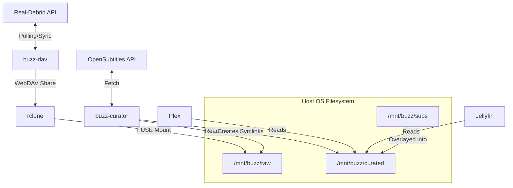
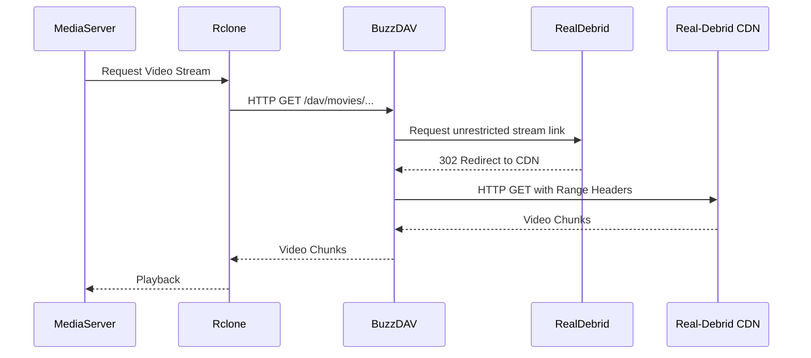
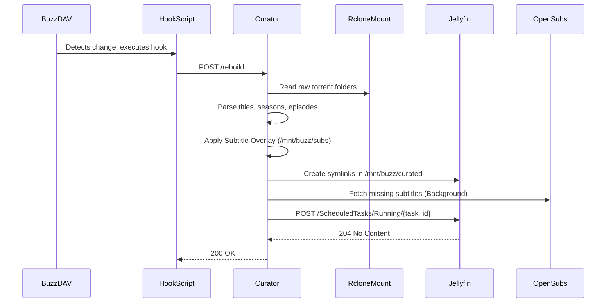

# Architecture

This document describes the internal architecture of Buzz, its components, and the data flow between them.

## High-Level Overview

Buzz is designed to provide a stable, curated media library from a Real-Debrid account. It consists of two main services that work together to expose a virtual filesystem to your media server (Plex or Jellyfin).

### Core Components

1.  **DAV Server (`buzz-dav`)**:
    - The entry point for the stack.
    - Responsible for polling the Real-Debrid API for changes in the torrent list.
    - Maintains a local SQLite database and generates "snapshots" of the virtual library.
    - Serves the virtual library over a read-only WebDAV interface at `/dav`.
    - Provides a lightweight Web UI for management (adding/deleting torrents, triggering syncs).

2.  **Curator Service (`buzz-curator`)**:
    - A sidecar service that watches the "raw" WebDAV mount (via `rclone`).
    - It parses the raw torrent folders and organizes them into a clean, curated structure (e.g., `/mnt/buzz/curated/movies`, `/mnt/buzz/curated/shows`).
    - It handles naming convention logic and ensures that your media server can easily identify content.
    - It triggers library updates on the media server after a successful curation pass.

3.  **Rclone**:
    - Acts as the bridge between the DAV server and the filesystem.
    - It mounts the `buzz-dav` WebDAV share as a local FUSE mount at `/mnt/buzz/raw`.

---

## Service Interaction Diagram

This diagram shows how the Docker services interact and how data flows from Real-Debrid to your media server.

---

## Functional Block: WebDAV and Rclone Interaction

When a media server requests a file, `rclone` translates that into a WebDAV request to `buzz-dav`. `buzz-dav` then fetches the actual stream link from Real-Debrid and proxies the stream.

---

## Functional Block: Curator and Media Server Refresh Flow

When the `buzz-dav` service detects a change in the Real-Debrid library, it triggers a post-sync hook. This hook informs the Curator to rebuild the curated library and then notifies the media server.

---

## Common Workflows

### 1. Adding a Torrent via the UI
1.  The user visits the `buzz-dav` Web UI (default port 9999).
2.  The user enters a magnet link and clicks "Add".
3.  `buzz-dav` sends the magnet link to Real-Debrid via the API.
4.  Real-Debrid starts caching/downloading the torrent.
5.  The background `Poller` in `buzz-dav` detects the new torrent and waits for it to be fully cached.
6.  Once cached, `buzz-dav` generates a new VFS snapshot and triggers the `on_library_change` hook.

### 2. Perceiving Upstream Changes
1.  The `Poller` runs every `poll_interval_secs` (default 10s).
2.  It checks the RD torrent list and compares it with its internal database.
3.  If a change is detected (new torrent, deleted torrent, or status change), it waits for `rd_update_delay_secs` (default 15s) to allow the RD inventory to settle.
4.  A new snapshot is generated, updating the WebDAV view.
5.  The refresh hook is triggered.

### 3. Manual Sync
1.  User clicks "Sync" in the Web UI.
2.  `buzz-dav` immediately polls the RD API, bypassing the interval.
3.  If changes are found, it proceeds with snapshot generation and hook execution immediately.

## Operator UI Integration

The operator-facing HTML pages now use a split architecture:

1.  FastAPI remains the outer application shell for `/dav`, health checks, and
    machine-facing JSON endpoints such as `/api/cache/*`, `/api/config`, and
    `/sync`.
2.  A small embedded `PyView` application is initialized inside `DavApp` and
    its routes are appended into the same ASGI router for `/archive`, `/logs`,
    and `/config`.
3.  `PyView`'s websocket endpoint lives at `/live/websocket`, and its bundled
    frontend asset is mounted separately at `/pyview/assets/app.js` so it does
    not collide with Buzz's existing `/static` directory.
4.  The live views call the same in-process state and config helpers used by
    the REST handlers, which keeps the mutation boundary shallow and makes the
    UI layer reversible if `pyview-web` proves to be the wrong fit.

## Subtitle Integration

Buzz integrates directly with OpenSubtitles.com REST API v2 to automatically fetch subtitles for your media.

### Persistent Overlay

To ensure that subtitles survive the curator's "wipe-and-replace" rebuild cycle, they are stored in a persistent directory: `/mnt/buzz/subs`.

1.  **Overlay Phase**: During every rebuild, the curator walks the `/mnt/buzz/subs` directory and creates symlinks in the temporary build tree that point back to these persistent `.srt` files.
2.  **Background Fetching**: After a rebuild completes, if `subtitles.enabled` is true, a background thread is spawned. It identifies any video files in the curated library that are missing a corresponding subtitle in the overlay and attempts to download them from OpenSubtitles.
3.  **Ranking Strategies**: The fetcher supports various strategies (e.g., `most-downloaded`, `best-match`) to ensure you get the highest quality subtitle for your specific release.

The fetcher respects rate limits and follows a fallback chain if your preferred strategy yields no results.
