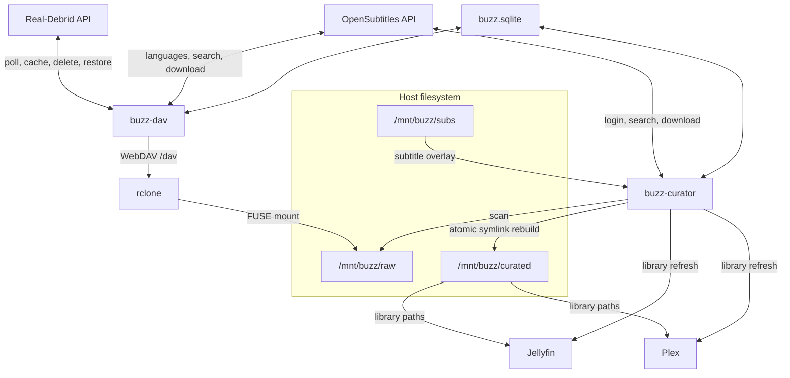
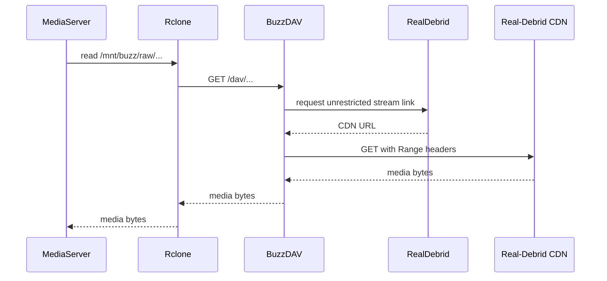
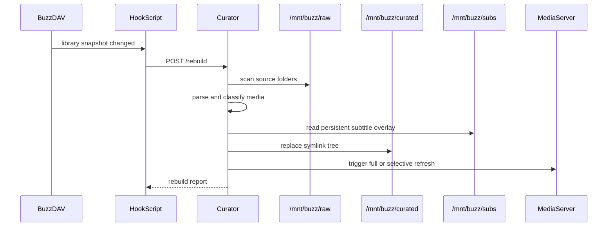

# Architecture

This document describes Buzz from a maintainer's point of view: runtime
components, state ownership, data flow, and the boundaries between the DAV
front end, curator sidecar, operator UI, and deployment pipeline.

For installation commands and operator-facing configuration tables, see the
[README](../README.md).

## Runtime Topology

Buzz turns a Real-Debrid torrent library into a stable filesystem layout for
Jellyfin or Plex. The runtime is more than one Python process:

- `buzz-dav` is the front-end service. It polls Real-Debrid, stores machine
  state in SQLite, exposes the read-only WebDAV tree at `/dav`, and hosts the
  operator UI.
- `rclone` mounts `buzz-dav`'s WebDAV tree at `/mnt/buzz/raw`. Media servers
  never talk to Real-Debrid directly; they read through this mount.
- `buzz-curator` is a sidecar service. It scans `/mnt/buzz/raw`, builds a clean
  symlink library under `/mnt/buzz/curated`, overlays subtitles from
  `/mnt/buzz/subs`, persists its mapping/report, and notifies media servers.
- Jellyfin or Plex reads `/mnt/buzz/curated`. Their libraries should point at
  category subdirectories such as `movies`, `shows`, and `anime`.
- `buzz.sqlite` is shared machine-managed state. It lives under the configured
  `state_dir`, which is `/app/data` in containers and `./data` on the host
  through Compose.

## State Model

Machine-managed persistence lives in `buzz.sqlite`. User-edited configuration
stays in YAML and environment files. Code should open the database through
`buzz.core.db.connect()` and apply migrations before use.

The database currently contains:

| Table | Owner | Purpose |
| --- | --- | --- |
| `schema_version` | shared | Tracks applied SQLite migrations. |
| `torrents` | `buzz-dav` | Real-Debrid torrent signatures, API payloads, update times, and magnets. |
| `archive` | `buzz-dav` | Deleted/archived torrent metadata used for restore and permanent delete flows. |
| `library_snapshot` | `buzz-dav` | Canonical WebDAV tree snapshot and digest used to detect meaningful changes. |
| `curator_mapping` | `buzz-curator` | Source-to-target symlink mapping for curated files. |
| `curator_report` | `buzz-curator` | Last rebuild report, including counts and media-server scan scope. |
| `subtitle_metadata` | `buzz-curator` | Downloaded subtitle file IDs and release metadata keyed by overlay path. |
| `opensubtitles_languages` | `buzz-dav` | Cached OpenSubtitles language list for the config UI. |
| `opensubtitles_languages_meta` | `buzz-dav` | Fetch timestamp for the cached language list. |

Legacy JSON state files are imported into SQLite on first use when the target
table is empty. Imported files are renamed with a `.migrated` suffix. New code
should not add JSON machine state; JSON/YAML files are for user-editable
configuration only.

## Configuration Model

`buzz.yml` is loaded into Pydantic models in `buzz.models`. Environment
variables provide deployment-level defaults, while the YAML file remains the
operator's explicit configuration source.

There are three important config views:

- **Saved config** is what is present in `buzz.yml`.
- **Effective config** is the saved config merged with defaults and container
  environment values.
- **UI override config** is the subset of fields the config UI is allowed to
  write back to `buzz.yml`.

The config UI masks secrets before displaying YAML. Secret paths include
`provider.token` and OpenSubtitles credentials under
`subtitles.opensubtitles.*`.

Reload behavior is field-specific:

- `server.bind` and `server.port` require a service restart.
- Hot-reloadable fields are applied in-process by `buzz-dav` and then relayed
  to `buzz-curator` through `/api/config/reload`.
- If curator reload fails, the DAV process records a structured event so the
  operator sees the failure in `/logs`.

## DAV Service Internals

`buzz-dav` is implemented by `buzz.dav_app.DavApp` and `buzz.core.state`.
It is both a WebDAV front end and the coordination point for operator actions.

Main responsibilities:

- Poll Real-Debrid on `poll_interval_secs` and compare current torrent
  signatures against the `torrents` table.
- Delay hook execution by `hooks.rd_update_delay_secs` after RD changes so the
  inventory can settle before curation.
- Generate a canonical library snapshot and store its digest in
  `library_snapshot`.
- Expose cache/archive/config/log pages and JSON endpoints.
- Trigger curator rebuilds and subtitle fetches over HTTP when configured.
- Serve WebDAV `PROPFIND`, `GET`, and `HEAD` under `/dav/{path:path}`.

Important DAV routes:

| Route | Role |
| --- | --- |
| `/`, `/cache`, `/archive`, `/logs`, `/config` | Operator UI pages. |
| `/healthz` | Process liveness. |
| `/readyz` | Readiness, including DAV state and curator readiness when configured. |
| `/sync` | Manual RD sync. |
| `/api/config`, `/api/config/restore-defaults` | Config read/write and reset. |
| `/api/ui/notify` | Curator-to-DAV event notification. |
| `/api/curator/rebuild` | Manual curator rebuild proxy. |
| `/api/subtitles/fetch-torrent` | Torrent-scoped subtitle fetch proxy. |
| `/api/logs` | Recent structured events. |
| `/dav/{path:path}` | WebDAV tree and media streaming. |

When a media server reads a file, `rclone` translates that read into a WebDAV
request. `buzz-dav` resolves the requested virtual file to the Real-Debrid
file entry, obtains an unrestricted stream URL, and proxies the response with
range support. `server.stream_buffer_size` and `server.upstream_concurrency`
control stream behavior.

## Curator Service Internals

`buzz-curator` is implemented by `buzz.curator_app.CuratorApp` and
`buzz.core.curator`. It receives rebuild requests, creates the curated library,
and handles media-server refreshes.

Rebuild flow:

1. Receive `/rebuild`, optionally with changed roots from `buzz-dav`.
2. Read `/mnt/buzz/raw` through the rclone mount.
3. Classify entries into movies, shows, and anime using media parsing helpers
   and configured anime patterns.
4. Create a temporary build tree under the target root.
5. Apply the persistent subtitle overlay from `/mnt/buzz/subs`.
6. Replace the curated symlink tree under `/mnt/buzz/curated`.
7. Persist `curator_mapping` and `curator_report` in SQLite.
8. Trigger Jellyfin refresh when credentials are configured.
9. Optionally start background subtitle fetching if
   `subtitles.enabled` and `subtitles.fetch_on_resync` are true.

Curator routes:

| Route | Role |
| --- | --- |
| `/healthz` | Process liveness. |
| `/rebuild` | Rebuild curated symlink tree. |
| `/api/config/reload` | Reload YAML config after DAV-side config updates. |
| `/api/logs`, `/api/logs/count` | Curator event access. |
| `/api/subtitles/status` | Background subtitle fetch status. |
| `/api/subtitles/fetch` | Full-library or torrent-scoped subtitle fetch. |

## Operator UI Architecture

FastAPI remains the outer ASGI application for WebDAV, health checks, and JSON
endpoints. The operator pages are implemented with an embedded `PyView`
application built in `buzz.ui_live`.

The UI architecture has two boundaries:

- PyView owns live pages, navigation, websocket updates, and the HTML templates
  under `buzz/pyview_templates`.
- `DavApp` owns mutations and state access. Live views call in-process owner
  methods instead of duplicating database or Real-Debrid logic.

The PyView websocket endpoint is mounted at `/live/websocket`. PyView's bundled
frontend asset is mounted at `/pyview/assets/app.js`, separate from Buzz's
static assets under `/static`.

Page responsibilities:

- `/cache` shows current RD cache entries and exposes add, delete, resync, and
  torrent-scoped subtitle actions.
- `/archive` shows archived/deleted items and exposes restore/permanent delete
  actions.
- `/logs` renders structured DAV and curator events.
- `/config` edits the UI-managed subset of `buzz.yml`, marks restart-required
  fields, masks secrets, and can refresh OpenSubtitles language metadata.

## Event And Log Flow

`buzz.core.events.EventRegistry` is a process-local, thread-safe ring buffer.
Both services record structured log-style events through `record_event()`.
Events are also printed to stdout for container-log visibility.

The DAV process uses events for local UI state, `/api/logs`, and the live logs
page. The curator has its own event registry and notifies the DAV UI by posting
to `/api/ui/notify` for important status/log changes. This keeps the two
services independent while giving operators one place to inspect recent
activity.

Event producers include:

- RD sync and snapshot changes in `buzz.core.state`.
- Cache/archive actions in `DavApp`.
- Curator rebuild and mapping diffs in `buzz.core.curator`.
- Config reloads in both services.
- Subtitle background fetch status and errors.

## Subtitle Pipeline

Subtitles are stored outside the curated tree so they survive the curator's
wipe-and-replace rebuild strategy. The persistent root is `/mnt/buzz/subs`;
the curator symlinks matching `.srt` files into the temporary build tree during
every rebuild.

There are two OpenSubtitles integrations:

- `buzz-dav` fetches and caches the language list for the config UI.
- `buzz-curator` logs in, searches, ranks, downloads, and installs subtitles.

Subtitle fetch flow:

1. Build or load the current curator mapping.
2. Restrict the mapping to one torrent when a torrent-scoped fetch is requested.
3. For each target video and configured language, skip existing overlay files.
4. Search OpenSubtitles using parsed media metadata and source filename hints.
5. Filter and rank results according to `subtitles.strategy` and
   `subtitles.filters.*`.
6. Download the best result, write it under `/mnt/buzz/subs`, and persist
   `subtitle_metadata`.
7. Symlink the subtitle into the curated tree for immediate visibility.
8. Trigger selective Jellyfin refresh for fetched subtitle targets when possible.

The background fetcher exposes process state through
`/api/subtitles/status`, including whether it is running, current item, and
error counters.

## Media Server Refresh

Media-server refresh lives behind helpers in `buzz.core.media_server`.
The curator chooses between full and selective refresh based on the rebuild
input and available configuration.

- Jellyfin supports selective refresh when changed roots can be mapped to
  Jellyfin libraries through `media_server.library_map` or discovered library
  paths.
- Jellyfin full refresh uses a scan task ID when configured or discoverable.
- Plex can read the curated library, but the current automatic refresh
  implementation is Jellyfin-specific.
- Subtitle downloads can trigger a selective Jellyfin refresh for the specific
  targets that received new `.srt` files.

The curator report records enough information for operators and tests to see
whether a rebuild used full or selective scanning.

## Deployment And CI Architecture

GitLab is the canonical repository:
`https://gitlab.com/gabriel.chamon/buzz`. GitHub is intended to remain a
read-only mirror once project-level push mirroring is configured.

The production Compose file pulls the published image:
`registry.gitlab.com/gabriel.chamon/buzz/buzz:v1`. Development keeps local
builds in `docker-compose.dev.yml`, which overlays a `build:` block and source
mounts on top of the production Compose file.

The GitLab pipeline is split under `.gitlab/ci/` and assembled by
`.gitlab-ci.yml`:

- Gitleaks runs as a direct CI job.
- Test jobs are included only when Python, template, dependency, or lint config
  files change.
- Image publishing reuses the shared
  `gitlab.com/gabriel.chamon/ci-components/docker-build@v1` component.
- Security scanning uses GitLab Free-compatible jobs. Python dependency
  scanning is a Buzz-local Trivy job over `uv.lock` because GitLab's native
  dependency scanning is not available on the Free plan. Container scanning
  builds a commit-scoped Buzz image and scans it with GitLab's Free container
  scanning template. Local gate jobs parse generated GitLab security reports
  where needed and block `HIGH` or `CRITICAL` findings.
- Moving major tags reuses `gabriel.chamon/ci-components/release-tags.yml`.

The Docker build component publishes under
`$CI_REGISTRY_IMAGE/<image_name>:<tag>`, so this project's `image_name: buzz`
resolves to `registry.gitlab.com/gabriel.chamon/buzz/buzz:v1` for the tracked
major tag.

Renovate proposes dependency, Dockerfile, Compose, and GitLab CI image updates.
Normal updates wait at least seven days after upstream publication and
automerge is disabled. Docker references are pinned by digest where practical
so image changes are explicit merge requests. The published Buzz runtime image
remains `registry.gitlab.com/gabriel.chamon/buzz/buzz:v1` in operator-facing
Compose services and is excluded from Renovate update proposals to avoid
self-update loops.

## Key Invariants

- Only `buzz-dav` talks to Real-Debrid for torrent inventory and WebDAV stream
  resolution.
- `rclone` is the bridge between WebDAV and the host filesystem; the curator
  reads the rclone mount, not Real-Debrid.
- `buzz.sqlite` is machine state. `buzz.yml`, `.env`, and compose files are
  user/operator state.
- The curated tree can be deleted and rebuilt; persistent subtitles must live
  under `/mnt/buzz/subs`.
- The operator UI should call existing service methods and repository helpers
  instead of owning separate persistence or Real-Debrid logic.
- Cross-service coordination happens over HTTP; in-process helpers stay inside
  one service boundary.
